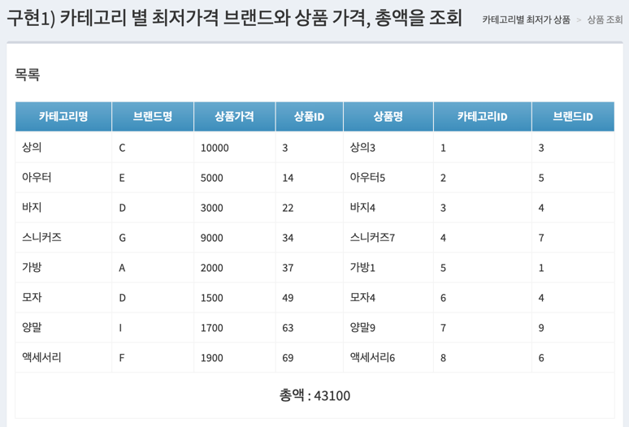

# [MUSINSA] Java(Kotlin) Backend Engineer - 과제 (장정우)

## 패키지 구조
```
 musinsa
     ├── domain
     │     ├── admin
     │     │     ├── controller
     │     │     ├── dto
     │     │     └── service
     │     ├── brand
     │     │     ├── controller
     │     │     ├── dto
     │     │     ├── entity
     │     │     ├── repository     
     │     │     └── service
     │     ├── category
     │     │     ├── controller
     │     │     ├── dto
     │     │     ├── entity
     │     │     ├── repository     
     │     │     └── service
     │     └── product
     │           ├── controller
     │           ├── dto
     │           ├── entity
     │           ├── repository     
     │           └── service
     └── global
           ├── common
           ├── config
           ├── exception
           ├── jpa
           ├── querydsl
           ├── redis
           └── util
```

## 환경
- java 17
- spring boot 3.4.3
- IDE : IntelliJ IDEA
- template engine : Thymeleaf
- OS : macOS

## Local 레디스 개발환경을 위한 Docker
- Container List
  - redis:latest
- 실행방법
  ```
  $ cd docker
  $ docker-compose up -d
  ```

## 어플리케이션 실행 방법
- http://localhost:8080/
- intelliJ에서 Run MusinsaBackendAssignmentApplication 실행
- 터미널에서 실행 방법
  - 터미널에서 실행하면 템플릿 엔진 페이지(프론트엔드)를 찾지 못하여 intelliJ에서 실행 추천(개선 포인트)
      ```
      $ ./gradlew build
      $ ./gradlew bootJar
      $ cd build/libs
      $ java -jar musinsa-backend-assignment-0.0.1-SNAPSHOT.jar
      ```
- 

## 테스트코드 실행 방법
- intelliJ에서 Project > test > java에서 우클릭한 후 > More Run/Debug > Run ... with Coverage 실행
- 터미널에서 실행 방법
  ```
  $ ./gradlew clean test --info
  ```
- 

## H2 Console
http://localhost:8080/h2-console/
- jdbc url : jdbc:h2:mem:product
- 

## 스웨거
http://localhost:8080/swagger-ui
- 

## **API 설계**
### 카테고리

| 기능         | 메소드 | URL | RETURN TYPE                           |
|------------| --- | --- |---------------------------------------|
| 카테고리 목록 조회 | GET | /api/category | ResponseObject\<List\<CategoryDto\>\> |
| 카테고리 단건 조회 | GET | /api/category/{categoryId} | ResponseObject\<CategoryDto\>         |
| 카테고리 등록    | POST | /api/category | ResponseObject\<CategoryDto\>         |
| 카테고리 수정    | PUT | /api/category | ResponseObject\<CategoryDto\>         |
| 카테고리 삭제    | DELETE | /api/category/{categoryId} | ResponseObject\<ResponseResult\>      |
| 카테고리 카운트   | GET | /api/category/count | ResponseObject\<Integer\>      |

### 브랜드

| 기능         | 메소드 | URL | RETURN TYPE                           |
|------------| --- | --- |---------------------------------------|
| 브랜드 목록 조회 | GET | /api/brand | ResponseObject\<List\<BrandDto\>\> |
| 브랜드 단건 조회 | GET | /api/brand/{brandId} | ResponseObject\<BrandDto\>         |
| 브랜드 등록    | POST | /api/brand | ResponseObject\<BrandDto\>         |
| 브랜드 수정    | PUT | /api/brand | ResponseObject\<BrandDto\>         |
| 브랜드 삭제    | DELETE | /api/brand/{brandId} | ResponseObject\<ResponseResult\>      |
| 브랜드 카운트   | GET | /api/brand/count | ResponseObject\<Integer\>      |

### 상품(기본)

| 기능         | 메소드 | URL | RETURN TYPE                          |
|------------| --- | --- |--------------------------------------|
| 상품 목록 조회 | GET | /api/product | ResponseObject\<List\<ProductDto\>\> |
| 상품 단건 조회 | GET | /api/product/{productId} | ResponseObject\<ProductDto\>         |
| 상품 등록    | POST | /api/product | ResponseObject\<ProductSetDto\>      |
| 상품 수정    | PUT | /api/product | ResponseObject\<ProductSetDto\>      |
| 상품 삭제    | DELETE | /api/product/{productId} | ResponseObject\<ResponseResult\>     |
| 상품 카운트   | GET | /api/product/count | ResponseObject\<Integer\>            |

### 상품 조회(구현)

| 기능         | 메소드 | URL                                                    | RETURN TYPE                          |
|------------| --- |--------------------------------------------------------|--------------------------------------|
| 카테고리별 최저가 상품 | GET | /api/product/lowest                                    | ResponseObject\<ProductLowestTotalDto\> |
| 단일 브랜드 최저가 상품 조회 | GET | /api/product/brandLowest                               | ResponseObject\<ProductByBrandTotalDto\>        |
| 카테고리 이름으로 최저, 최고 가격 브랜드와 상품 가격을 조회    | POST | /api/product/findProductByCategoryName?categoryName={categoryName} | ResponseObject\<ProductMinMaxByCategoryNameDto\>     |

## 화면 설명
### 메인
- 대시보드 확인 가능한 화면
- http://localhost:8080/
- 

### 카테고리 관리
#### 카테고리 목록
- 카테고리 목록 화면
- http://localhost:8080/pages/category
- 

#### 카테고리 등록
- 카테고리 등록 화면
- http://localhost:8080/pages/categoryAdd
- 

#### 카테고리 수정/삭제
- 카테고리 수정/삭제 화면
- http://localhost:8080/pages/categoryEdit/1
- 

### 브랜드 관리
#### 브랜드 목록
- 브랜드 목록 화면
- http://localhost:8080/pages/brand
- 

#### 브랜드 등록
- 브랜드 등록 화면
- http://localhost:8080/pages/brandAdd
- 

#### 브랜드 수정/삭제
- 브랜드 수정/삭제 화면
- http://localhost:8080/pages/brandEdit/1
- 

### 상품 관리
#### 상품 목록
- 상품 목록 화면
- http://localhost:8080/pages/product
- 

#### 상품 등록
- 상품 등록 화면
- http://localhost:8080/pages/productAdd
- 

#### 상품 수정/삭제
- 상품 수정/삭제 화면
- http://localhost:8080/pages/productEdit/1
- 

### 상품 관리
#### 구현1
- 구현1) 카테고리 별 최저가격 브랜드와 상품 가격, 총액을 조회
- http://localhost:8080/pages/categoryLowest
- 

#### 구현2
- 구현 2) 단일 브랜드로 모든 카테고리 상품을 구매할 때 최저가격에 판매하는 브랜드와 카테고리의 상품가격, 총액을 조회
- http://localhost:8080/pages/brandLowest
- 

#### 구현3
- 구현 3) 카테고리 이름으로 최저, 최고 가격 브랜드와 상품 가격을 조회
- http://localhost:8080/pages/minMaxProduct
- 

###

#### PS
바쁘신 와중에도 과제 리뷰해주셔서 감사합니다.